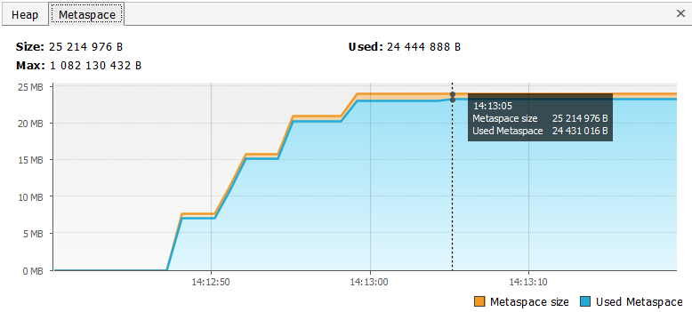

# Задача "Понимание JVM"

## Описание
Просмотрите код ниже и опишите (текстово или с картинками) каждую строку с точки зрения происходящего в JVM

Не забудьте упомянуть про:
- ClassLoader'ы,
- области памяти (стэк (и его фреймы), хип, метаспейс)
- сборщик мусора

## Код для исследования
```java

public class JvmComprehension {

    public static void main(String[] args) {
        int i = 1;                      // 1
        Object o = new Object();        // 2
        Integer ii = 2;                 // 3
        printAll(o, i, ii);             // 4
        System.out.println("finished"); // 7
    }

    private static void printAll(Object o, int i, Integer ii) {
        Integer uselessVar = 700;                   // 5
        System.out.println(o.toString() + i + ii);  // 6
    }
}

```
## Решение
Класс JvmComprehension загружается через подсистему загрузчиков классов -
ClassLoaders, где ищется данный класс по очереди на 3-х уровнях:
bootstrap, platform, application. Если класс находится на каком-то из
уровней, то происходит его загрузка, также осуществляется проверка
валидености кода, подготовка примитивов статических полей,
связывание ссылок на другие классы (если есть). Данные об этом классе
перемещаются для хранения в metaspace.

1.1. В Stack формируется фрейм main
1. Так как, int является примитивным типом данных, то он хранится в Stack.
   Во фрейме main создается переменная `i`, значение которой = 1.
2. Вызывается конструктор Object. Он создается в heap. Переменная `о`
   создается в Stack фрейма main и хранит в себе ссылку на объект типа Object,
   который хранится в heap.
3. Так как, Integer является ссылочной переменной, то переменная `ii`
   помещается в Stack main и хранит в себе ссылку на значение объекта Integer,
   а само значение объекта создается для хранения в heap.
4. В Stack создается новый фрейм printAll. Туда передаются ссылки на объекты.
   Во фрейме printAll(в Stack) создаются переменные `o` и `ii`, которые содержат
   ссылку на объекты Object и Integer в heap, а также в Stack создается
   переменная `i` со значением 1
5. В Stack во фрейме printAll для хранения создается переменная uselessVar,
   которая хранит в себе ссылку на объект Integer. Сам объект со значением
   700 хранится в heap.
6. В Stack создаются фреймы println и toString. В фрейм println передаются
   переменные `i` со значением 1, `ii`, `o`. Переменные `ii` и `o` хранят ссылки на
   объекты Object, Integer в heap.
7. В Stack создается новый фрейм println, куда передается ссылка на объект
   String, значение которого "finished". Сам же объект типа String со
   значением создается для хранения в heap.

# Задача "Исследование JVM через VisualVM"

## Решение

Результат вывода в консоль программы:
```
> Task :compileJava UP-TO-DATE
> Task :processResources NO-SOURCE
> Task :classes UP-TO-DATE

> Task :JvmExperience.main()
Please open 'ru.netology.JvmExperience' in VisualVm
14:12:47.270419300: loading io.vertx
14:12:47.783456200: loaded 529 classes
14:12:50.798211400: loading io.netty
14:12:51.841292800: loaded 2117 classes
14:12:54.841647200: loading org.springframework
14:12:55.222675800: loaded 869 classes
14:12:58.222717700: now see heap
14:12:58.222717700: creating 5000000 objects
14:12:58.676750500: created
14:13:01.691338100: creating 5000000 objects
14:13:02.053363900: created
14:13:05.132557400: creating 5000000 objects
14:13:05.575588900: created

BUILD SUCCESSFUL in 52s
2 actionable tasks: 1 executed, 1 up-to-date
14:13:09: Execution finished ':JvmExperience.main()'.
```


Загрузка io.vertx: загружено 529 классов. 
Metaspace для их хранения был увеличен.
___


Загрузка io.netty: загружено 2117 классов. 
Metaspace снова вырос. Heap уменьшился из-за Garbage Collector.
___


Загрузка org.springframework: загружено 869 классов. 
Увеличение Metaspace. Сильное увеличение Heap 
из-за множества экземпляров классов.
___


Создание 5000000 объектов: количество загруженных 
классов изменилось незначительно. Metaspace немного 
увеличился - был подгружен 1 класс. 
Heap значительно вырос из-за создания большого 
количества объектов.
___


Создание 5000000 объектов во второй раз. 
Был загружен 1 класс. 
Metaspace также незначительно вырос. 
Heap также вырос.
___



Создание 5000000 объектов в третий раз.
Был также загружен 1 класс, Metaspace также вырос - 
при том как использованное место, так и 
зарезервированное. Heap растет.
